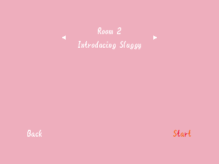
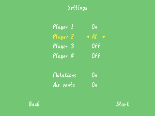
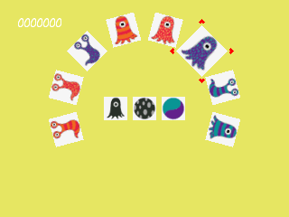
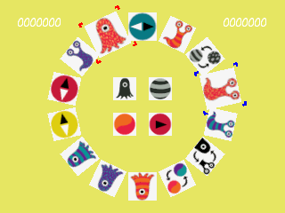
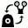

# Panic lab 64

N64 homebrew inspired by [Panic lab from Gigamic](https://en.gigamic.com/game/panic-lab).

# How to play

## Goal 

Starting from the arrow indicated by the direction die, each players tries to find the amoeba indicated by the shape, pattern, color dice as quickly as possible.

## Controls

 Rotate stick to move cursor around the circle

 Left and Right to move cursor around the circle

 A to validate selection

 START to quit current game

## Dice

### Shapes

### Patterns

### Colors

### Directions

## Cards

### Amoebas
_These are your targets!_

### Directions
_Your starting point!_

### Shape mutation

### Pattern mutation

### Color mutation

### Air vents
_Enter here, exit by the next air vent!_

# Acknowledgments

© Gigamic

Author: Dominique Ehrhard

Illustrator: Maxim Cyr
